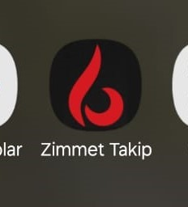
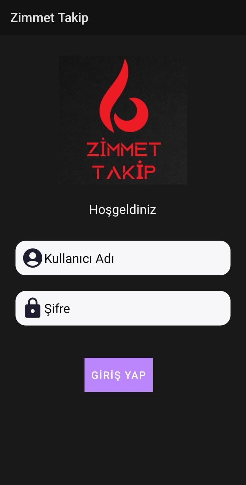
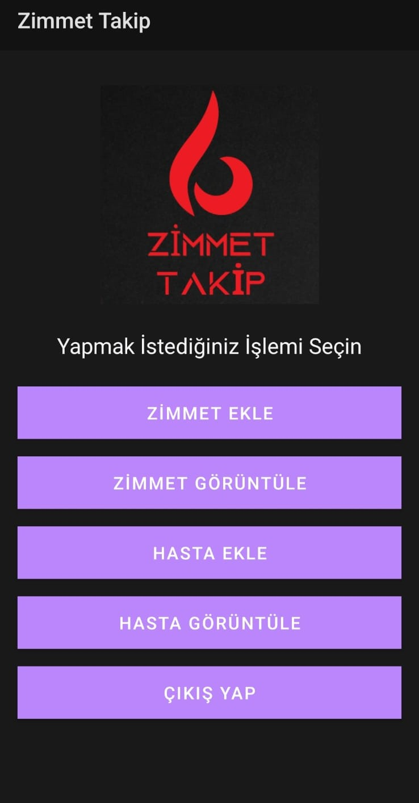
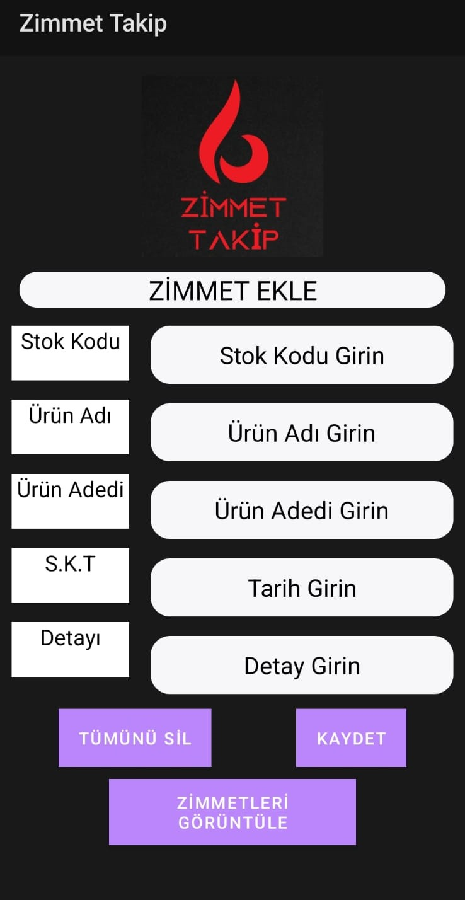
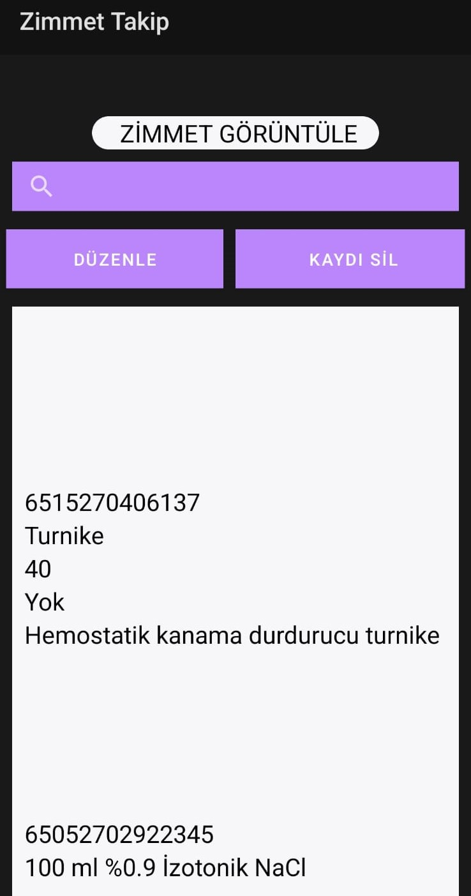
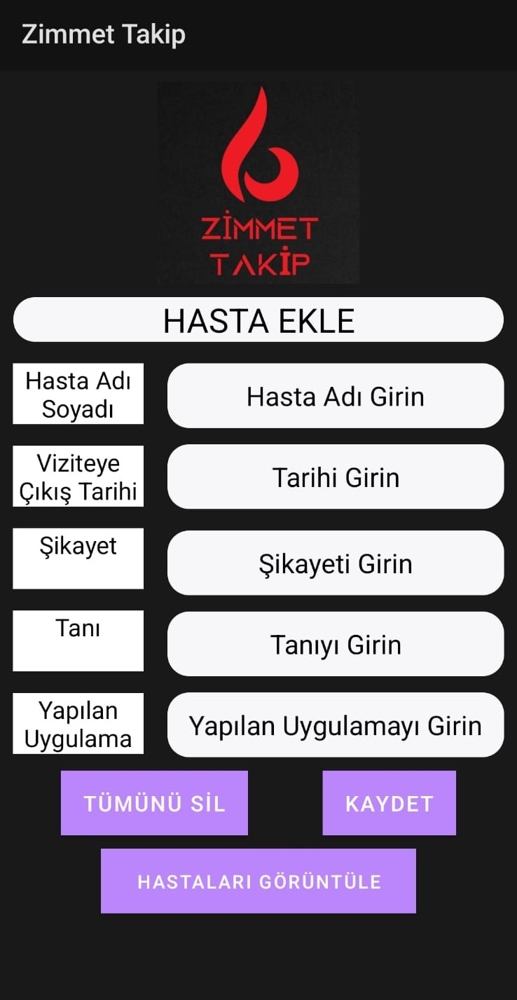

# Zimmet Takip Sistemi

**Zimmet Takip Sistemi**, askeri kullanım için özel olarak tasarlanmış bir mobil uygulamadır. Bu sistem, envanter takibi ve hasta bilgilerini kayıt altında tutmayı kolaylaştırır. Kotlin ve Java kullanılarak geliştirilmiş, SQLite veritabanı altyapısını kullanmaktadır.

## 🚀 Özellikler
- **Envanter Yönetimi:** Ekipmanların zimmetlenmesi ve takip edilmesi.
- **Hasta Takibi:** Hasta bilgilerini kayıt altına alma ve düzenleme.
- **Kullanıcı Dostu Arayüz:** Basit ve etkili bir kullanıcı deneyimi.
- **Offline Çalışma:** İnternet bağlantısına gerek duymadan kullanılabilir.

## 🛠️ Teknolojiler
- **Dil:** Kotlin, Java  
- **Veritabanı:** SQLite  
- **Platform:** Android  
## Ekran Görüntüleri

